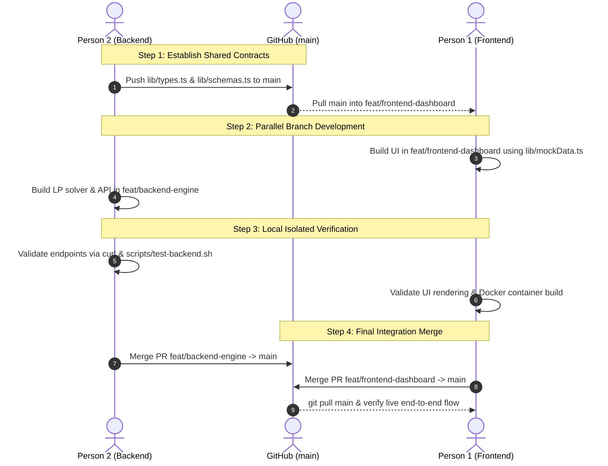

# AGENTS.md — Global System Rules & Team Collision Prevention Protocol
**BUP CSE Fest 2026 Hackathon (Smart Campus Energy Optimization Challenge)**  
**Target Environment**: Next.js App Router (TypeScript) | Dual-Developer Setup

---

## 1. Core Architecture & System Invariants

All AI agents (Antigravity, Google AI Studio, Copilot) operating on either development machine must adhere to these inviolable architectural constraints:

1. **Framework & Runtime**:
   - Next.js 15+ App Router using TypeScript in strict mode.
   - Node.js 20+ runtime.
   - Standalone output configured in `next.config.ts` (`output: 'standalone'`).

2. **Mandatory Root Endpoints (Zero Prefix Rule)**:
   - `GET /health` -> `app/health/route.ts` returning `{"status": "ok"}` with HTTP 200 ($< 50\text{ms}$ latency).
   - `POST /optimize-energy` -> `app/optimize-energy/route.ts` returning directive interpretation, 24-hour plan, and KPI summaries with HTTP 200.
   - **CRITICAL**: Never create or redirect through `/api/health` or `/api/optimize-energy`. Endpoints MUST be hosted directly at root level.

3. **Numerical Precision & Physical Tolerances**:
   - Absolute floating-point tolerance: $\pm 0.01\text{ kWh}$ for energy metrics and $\pm 0.01\text{ BDT}$ for financial figures.
   - All response floats must be rounded to two decimal places: `Number(val.toFixed(2))`.
   - Energy Balance Identity: At every hour $h \in [0, 23]$:
     $$|\text{grid\_kwh} + \text{solar\_used\_kwh} + \text{discharge\_kwh} - \text{demand\_kwh} - \text{charge\_kwh}| \le 0.01$$
   - End-of-Day Battery Neutrality:
     $$|\text{battery\_energy\_after\_kwh}[23] - \text{battery.initial\_energy\_kwh}| \le 0.01$$

4. **Performance & Latency Thresholds**:
   - $p95$ API latency target $\le 5.0\text{ seconds}$.
   - Hard execution timeout: $30.0\text{ seconds}$.
   - OpenAI model usage: `gpt-4o-mini` with temperature `0.0` and native JSON schema structured outputs.

5. **Secrets & Security Protocol**:
   - NEVER commit `.env`, `.env.local`, `.env.production`, or hardcoded API keys to git.
   - Access keys strictly via `process.env.OPENAI_API_KEY`.
   - Docker image must NOT contain any embedded keys or local credential files.

---

## 2. Strict File Ownership Matrix (Zero Merge Conflicts)

To allow both developers to work in parallel on separate laptops without git merge conflicts, file ownership is strictly divided. **An agent working on one person's branch must NEVER modify a file owned by the other person.**

```
                                    REPOSITORY ROOT
                                          │
             ┌────────────────────────────┴────────────────────────────┐
             ▼                                                         ▼
     PERSON 1 (Frontend & DevOps)                             PERSON 2 (Backend & Engine)
     Branch: feat/frontend-dashboard                          Branch: feat/backend-engine
     ───────────────────────────────                          ───────────────────────────
     • app/layout.tsx                                         • lib/types.ts (SINGLE SOURCE OF TRUTH)
     • app/globals.css                                        • lib/schemas.ts
     • app/page.tsx                                           • lib/llm/prompts.ts
     • components/*                                           • lib/llm/interpreter.ts
       - components/SamplePayloadSelector.tsx                 • lib/optimizer/guardrails.ts
       - components/EnergyScheduleChart.tsx                   • lib/optimizer/solver.ts
       - components/BatterySocChart.tsx                       • app/health/route.ts
       - components/CostSummaryCards.tsx                      • app/optimize-energy/route.ts
       - components/DirectiveTable.tsx                        • scripts/*
     • lib/mockData.ts (for decoupled UI test)                  - scripts/test-backend.sh
     • Dockerfile & .dockerignore                             • data/sample_scenario_*.json
     • README.md & demo video materials
```

### File Boundary Rules:
- **Contract Sanctity**: `lib/types.ts` is created and owned exclusively by **Person 2**. Person 1 consumes this file as a read-only dependency.
- **Frontend Decoupling**: If Person 1 needs data before Person 2 completes the backend routes, Person 1 must consume `lib/mockData.ts` (owned by Person 1) and must **not** modify `app/optimize-energy/route.ts`.
- **UI Components**: Person 2 must **never** touch any file inside `components/` or `app/page.tsx`.

---

## 3. Four-Step Git Integration Protocol

To ensure seamless merging and prevent rebasing conflicts during hackathon deadlines:



### Operational Workflow:
1. **Step 1 (Contract First)**: Person 2 creates and pushes `lib/types.ts` and `lib/schemas.ts` directly to `main`. Person 1 pulls `main` before initiating frontend implementation.
2. **Step 2 (Parallel Execution)**:
   - Person 1 checks out `feat/frontend-dashboard`.
   - Person 2 checks out `feat/backend-engine`.
3. **Step 3 (Independent Verification)**:
   - Person 2 tests routes locally using `curl http://localhost:3000/health` and `POST /optimize-energy`.
   - Person 1 verifies charts, layouts, and responsiveness using realistic mock payloads in `lib/mockData.ts`.
4. **Step 4 (Merge & Live Test)**:
   - Person 2 merges `feat/backend-engine` into `main`.
   - Person 1 re-bases/merges `main` into `feat/frontend-dashboard`, switches UI fetch to the live endpoint, merges into `main`, and runs `docker build -t smart-grid .`.

---

## 4. Directive Interpretation & Optimization Constraints Standard

All code produced by any agent must strictly abide by the mathematical definitions in `PROJECT_BLUEPRINT.md`:

| Directive Type | JSON Structure | Physical LP Effect |
| :--- | :--- | :--- |
| `solar_reduction` | `{"hours": number[], "factor": number}` | Multiplies solar ceiling: $\text{solar\_used}[h] \le \text{solar}[h] \times \text{factor}$. (e.g. 80% drop $\rightarrow \text{factor} = 0.20$). |
| `minimum_battery_reserve` | `{"hours": number[], "minimum_energy_kwh": number}` | Sets elevated battery reserve: $E[h] \ge \max(E_{\text{min}}, \text{minimum\_energy\_kwh})$. |
| `no_charge_window` | `{"hours": number[]}` | Forces charging rate to 0: $\text{charge}[h] = 0$. |
| `no_discharge_window`| `{"hours": number[]}` | Forces discharging rate to 0: $\text{discharge}[h] = 0$. |
| `max_grid_window` | `{"hours": number[], "max_grid_kwh": number}` | Caps grid import: $\text{grid}[h] \le \text{max\_grid\_kwh}$. |
| `no_op` | `null` (applies: `false`) | No mathematical adjustment applied to LP model. |

### Time Window Rules:
- Time intervals in operator notes are **start-inclusive, end-exclusive**:
  - "1 PM to 3 PM" or "13:00 to 15:00" $\rightarrow [13, 14]$.
  - "Between 8:00 and 11:00" $\rightarrow [8, 9, 10]$.
  - "At 14:00" $\rightarrow [14]$.
- All extracted hour indexes must be valid integers in $[0, 23]$.
